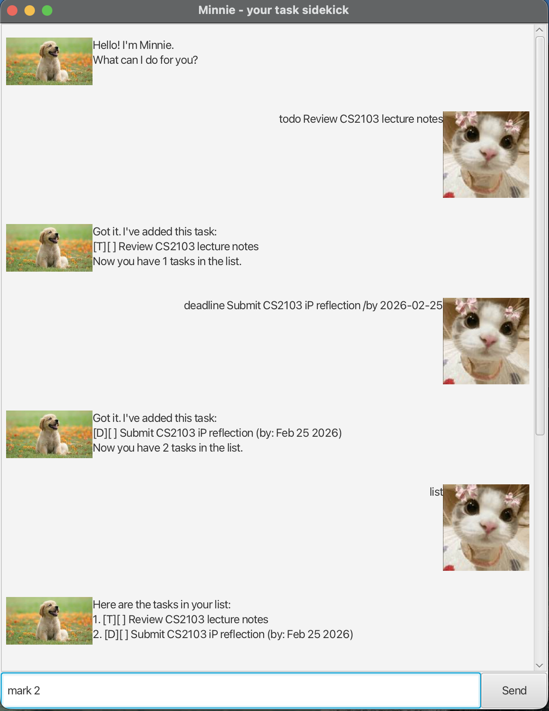

# Minnie User Guide

Minnie is a lightweight task-tracking chatbot with a GUI.  
Type commands in the input box and press **Enter** or click **Send**.

---

## Quick start

1. Launch the app.
2. Type a command (examples below).
3. Minnie replies in the chat window.
4. Your tasks are saved automatically to `data/minnie.txt`.

---

## Commands

### Add tasks

#### Todo
Adds a task without date/time.
- Format: `todo <description>`
- Example: `todo Review CS2103 lecture notes`

#### Deadline
Adds a task due by a specific date/time.
- Format: `deadline <description> /by <yyyy-mm-ddThh:mm>`
- Example: `deadline Submit iP reflection /by 2026-02-25T23:59`

#### Event
Adds a task with a start and end date/time.
- Format: `event <description> /from <start> /to <end>`
- Example: `event Team sync /from 2026-02-24T20:00 /to 2026-02-24T21:00`

---

### View tasks

#### List
Shows all tasks with numbering.
- Format: `list`

---

### Update tasks

> For `mark`, `unmark`, and `delete`, the task number is **1-based** (use the numbers shown in `list`).

#### Mark
Marks a task as done.
- Format: `mark <taskNumber>`
- Example: `mark 2`

#### Unmark
Marks a task as not done.
- Format: `unmark <taskNumber>`
- Example: `unmark 2`

#### Delete
Deletes a task.
- Format: `delete <taskNumber>`
- Example: `delete 3`

---

### Find tasks

Finds tasks whose description contains a keyword.
- Format: `find <keyword>`
- Example: `find CS2103`

---

### Exit

Closes the app.
- Format: `bye`

---

## Data storage

- Minnie saves tasks automatically whenever tasks are changed.
- Data file path: `data/minnie.txt`
- If the file/folder does not exist, Minnie will create it automatically.

---

## FAQ / Troubleshooting

### Minnie says it doesn’t understand my command
Check that your command matches the formats above (especially the `/by`, `/from`, `/to` parts).

### My dates are rejected
Use this format: `yyyy-mm-dd`  
Example: `2026-02-25T23:59`